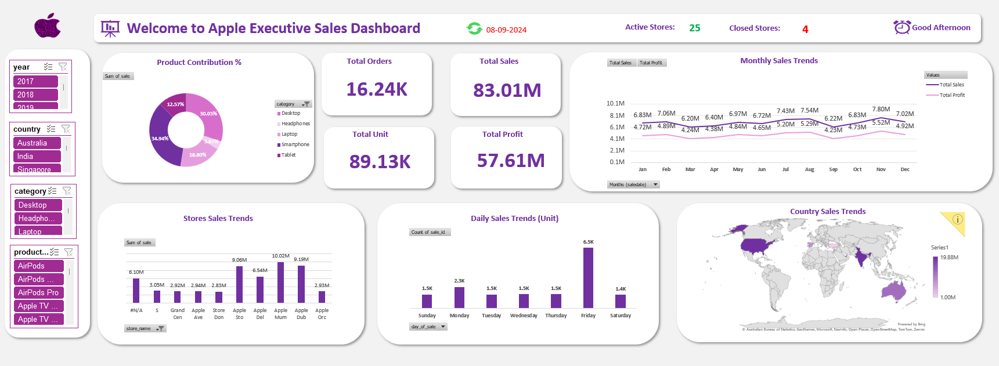

# 🍎 Apple Executive Sales Dashboard

## 📌 Overview
This project provides an interactive, executive-level analysis and visualization of Apple Store sales data. The comprehensive Excel dashboard highlights essential business metrics, trends, and insights through intuitive pivot tables, dynamic charts, and geographic visualizations.

## 📂 Data Source
The dashboard utilizes detailed Apple Store sales data, capturing essential details including:
- **Sales Dates**
- **Store Locations**
- **Sales Amounts**
- **Product Categories & Sub-Categories**
- **Product Names**
- **Customer Demographics**

## 🛠️ Data Cleaning & Preparation
The dataset underwent several preprocessing steps:
- **Imported** raw data into Excel for processing.
- **Applied** Excel's built-in formatting for data consistency.
- **Removed** duplicates and blank entries to maintain accuracy.
- **Extracted** Year and Month columns from date information for temporal analysis.
- **Simplified** product names for enhanced readability and visualization.

## 📊 Dashboard Components
The Excel dashboard includes interactive visualizations for key performance indicators (KPIs):

| Component                       | Description                                                   |
|---------------------------------|---------------------------------------------------------------|
| **Product Contribution (%)**    | Sales distribution by product category.                       |
| **Total Orders, Sales & Profit**| Quick summary of core business metrics.                       |
| **Monthly Sales Trends**        | Interactive monthly analysis of sales & profitability.        |
| **Store Sales Trends**          | Comparison of sales across Apple Store locations.             |
| **Daily Sales Trends (Units)**  | Analysis of sales patterns based on weekdays.                 |
| **Country Sales Trends**        | Geographic distribution of sales by country.                  |

## 🚀 How to Use
1. **Download** the Excel dashboard (`Final Dashboard.xlsx`) and dataset (`Data_set.xlsx`) files.
2. **Open** the Excel dashboard to interactively explore visual insights.

## 🙋‍♂️ Author
- **Venkata Krishna Sai**
